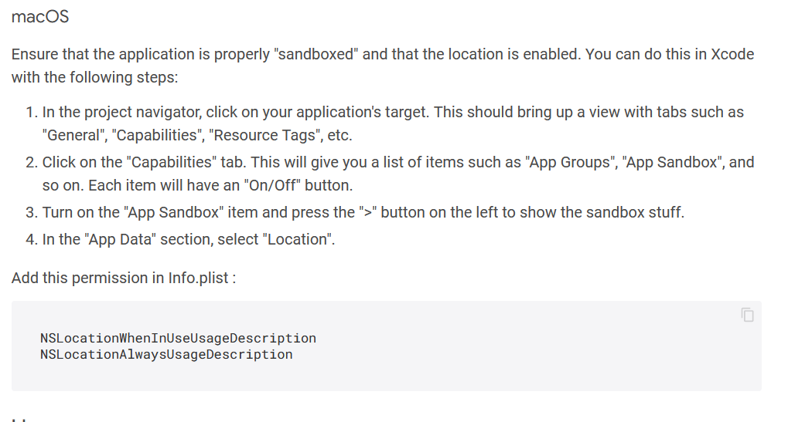

    # buff_lisa

A new Flutter project.

## Getting Started

This project is a starting point for a Flutter application.

A few resources to get you started if this is your first Flutter project:

- [Lab: Write your first Flutter app](https://docs.flutter.dev/get-started/codelab)
- [Cookbook: Useful Flutter samples](https://docs.flutter.dev/cookbook)

For help getting started with Flutter development, view the
[online documentation](https://docs.flutter.dev/), which offers tutorials,
samples, guidance on mobile development, and a full API reference.

### Set new icon
- change asset path in pubspec.yaml
- run: ```flutter packages pub run flutter_launcher_icons:main```
### Build apk
- run: ```flutter build apk```

### Build app bundle release (android)

- run: ```flutter build appbundle```

### TODO IOS 
- location: 
- flutter_secure_storage: 'You also need to add Keychain Sharing as capability to your macOS runner.'
- path_provider: access to external storage is not officially supported by package
- shared_preferences: might be another name...
- fluttertoast: package doesn't really support ios

### TODO all
- joining a private groups does not load members
- show with color the users color
- adding new pin does not update feed

